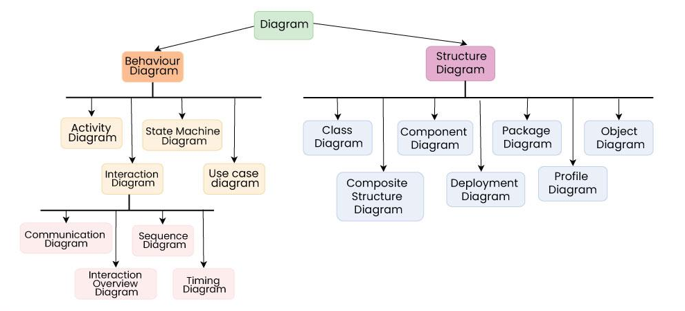

# UML

# What is UML?

**Unified Modeling Language (UML)** is a standardized, visual modeling language used to represent the design of a system. It serves as a flexible, versatile, and user-friendly method for visualizing, specifying, building, and documenting the artifacts of a software system.

## Key Features of UML:
- **Visual Representation**: Helps in visualizing a system’s architecture and design.
- **Standardized**: A globally accepted methodology for system modeling.
- **Versatile**: Applicable to a wide variety of systems and software projects.
- **User-Friendly**: Provides an intuitive approach for both technical and non-technical stakeholders.

## Purpose of UML:
UML diagrams are used to illustrate both the **behavior** and the **structure** of a system. 

### Benefits:
- **Software Engineers**: Helps in designing and analyzing system components and interactions.
- **Businessmen**: Provides a clear visual representation of how the system functions, aiding in better communication.
- **System Architects**: Assists in creating scalable and well-structured system designs.

# Types of UML Diagrams

UML is closely associated with **object-oriented design and analysis**. It utilizes various elements and establishes relationships between them to create diagrams. UML diagrams can be broadly classified into two main categories:

## 1. **Structural Diagrams**
These diagrams describe the static structure of a system. They focus on the elements that make up the system and their relationships. Key types of structural diagrams include:

- **Class Diagram**: Depicts the classes in a system, their attributes, methods, and the relationships between them.
- **Object Diagram**: Represents instances of objects and their relationships at a particular moment.
- **Component Diagram**: Shows the physical components in a system and how they interact with each other.
- **Deployment Diagram**: Displays the physical deployment of software components on hardware nodes.
- **Composite Structure Diagram**: Focuses on the internal structure of a class or component and their interactions.

## 2. **Behavioral Diagrams**
These diagrams capture the dynamic behavior of the system. They describe how the system interacts over time and responds to various events. Key types of behavioral diagrams include:

- **Use Case Diagram**: Represents the functional requirements of a system from the perspective of the end-user or other external systems.
- **Sequence Diagram**: Shows how objects interact in a specific sequence, detailing the flow of messages.
- **Activity Diagram**: Represents the workflow or activities in a system, showcasing the flow of control.
- **State Diagram**: Describes the states an object can be in and how it transitions between those states.
- **Communication Diagram**: Focuses on the interactions between objects, showing the message flow in the system.
- **Interaction Overview Diagram**: A high-level diagram that represents the flow of control between different interactions or processes.
- **Timing Diagram**: Used to model the behavior of objects in relation to time, showing changes in state or condition over time.

